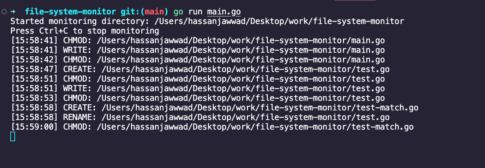

# File System Monitor

A robust and efficient file system monitoring tool written in Go that tracks and logs file system events in real-time. This project demonstrates the use of concurrent programming patterns and system-level programming in Go.

## Features

- Real-time monitoring of file system events (create, modify, delete, rename)
- Concurrent event processing using goroutines and channels
- Thread-safe event logging with mutex synchronization
- Support for monitoring any specified directory
- Timestamp-based event tracking
- Clean shutdown handling with signal interrupts

## Working 


## Installation

### Prerequisites

- Go 1.20 or higher
- `github.com/fsnotify/fsnotify` package

### Steps

1. Clone the repository:
   ```bash
   git clone <repository-url>
   cd <repository-directory>
   ```

2. Install dependencies:
   ```bash
   go mod download
   ```

3. Build the project:
   ```bash
   go build -o fsmonitor
   ```

## Usage

### Basic Usage

Monitor the current directory:
```bash
./fsmonitor
```

Monitor a specific directory:
```bash
./fsmonitor /path/to/directory
```

### Output Format

Events are displayed in the following format:
```
[HH:MM:SS] OPERATION: /path/to/file
```

Where:
- `HH:MM:SS` is the timestamp of the event
- `OPERATION` is the type of file system event (CREATE, WRITE, REMOVE, RENAME, etc.)
- `/path/to/file` is the absolute path of the affected file

## Implementation Details

### Core Components

#### FileEvent
Represents a file system event with:
- Path: The file path where the event occurred
- Operation: The type of operation
- Timestamp: When the event occurred

#### Monitor
The main monitoring struct that manages:
- FSNotify watcher
- Event channel for real-time updates
- Thread-safe event logging
- Graceful shutdown handling

### Concurrent Design

The project utilizes several Go concurrency patterns:

1. **Event Processing Goroutine**
   - Runs in the background processing file system events
   - Uses select statement for handling multiple channels
   - Implements graceful shutdown through done channel

2. **Thread-safe Event Logging**
   - Uses RWMutex for synchronizing access to the event log
   - Implements copy-on-read pattern for thread-safe event log access

3. **Event Broadcasting**
   - Uses channels to broadcast events to multiple consumers
   - Implements non-blocking event processing

## Error Handling

- Comprehensive error checking for file system operations
- Graceful handling of watcher creation failures
- Directory existence verification
- Path resolution to absolute paths

## Contributing

Contributions are welcome! Please feel free to submit a Pull Request.
